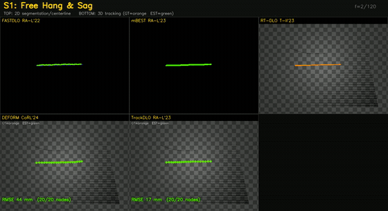

# DLO Perception & Tracking — Reproduce-and-Compare Benchmark

A deterministic, headless benchmark that **reproduces and compares published
Deformable Linear Object (DLO) perception and tracking methods** on a common
MuJoCo cable testbed, across seven deformation regimes — with accuracy/FPS
metrics and Pareto-frontier reports.



> Top row: 2D segmentation / centerline — **FASTDLO**, **mBEST**, **RT-DLO**.
> Bottom row: 3D tracking (GT = orange vs estimate = green) — **DEFORM**, **TrackDLO**.
> Seven phases: free-hang · bending · twisting · buckling · tangling · snap-through · plastic.

▶️ **Full demo (all 7 phases, 33 s):** [`outputs/demo_videos/dlo_phases_demo.mp4`](outputs/demo_videos/dlo_phases_demo.mp4)

---

## Reproduced methods

| Method | Paper | Type | Reproduction notes |
|---|---|---|---|
| **FASTDLO** | Caporali et al., RA-L 2022 | 2D seg + centerline | seg-CNN + similarity net; centerline via spline hook |
| **mBEST** | Choi et al., RA-L 2023 | 2D seg + centerline | Cython skeletonization core |
| **RT-DLO** | Caporali et al., T-II 2023 | 2D centerline | topology-aware graph centerline |
| **DEFORM** | Chen et al., CoRL 2024 | 3D tracking | physics core (DER) + GCN residual |
| **TrackDLO** | Xiang et al., RA-L 2023 | 3D RGB-D tracking | de-ROS'd C++ core, pybind-bound |

**Upstream contributions made during this work:**
- TrackDLO — pull request: https://github.com/RMDLO/trackdlo/pull/83
- adapteddlo_muj (DER-in-MuJoCo) — pull request: https://github.com/qj25/adapteddlo_muj/pull/1
- DLO-Lab (ICML 2026 simulator) — pull requests: https://github.com/UMass-Embodied-AGI/DLO-Lab/pull/1 (reviewed) → https://github.com/UMass-Embodied-AGI/DLO-Lab/pull/3 · issue: https://github.com/UMass-Embodied-AGI/DLO-Lab/issues/2

---

## Headline results

Common protocol, bit-identical frames per seed (the provider swaps the global
NumPy RNG state around sim stepping so method-side RNG cannot desynchronise the
force sequence). Method **compute time only** is timed.

### 2D perception

| method | centerline RMSE (px) | chamfer (px) | mask IoU | FPS (median) |
|---|---|---|---|---|
| FASTDLO | **13.4** | 3.5 | 0.870 | 52.6 |
| mBEST | 14.2 | **3.1** | 0.870 | 64.3 |
| RT-DLO | 19.8 | 4.2 | 0.870 | **98.1** |

### 3D tracking

| method | RMSE-3D mean (mm) | RMSE-3D median (mm) | FPS (median) |
|---|---|---|---|
| DEFORM | 140.3 | **128.0** | 14.8 |
| TrackDLO | (see report) | | 10.3 |

Full tables (per-scenario breakdown, length error, self-intersections, p95
latency, GPU/CPU matrix) and Pareto-frontier plots:
- [`outputs/bench/batch1_gpu/report_final.md`](outputs/bench/batch1_gpu/report_final.md)
- [`outputs/bench/batch1_gpu/frontier_2d.png`](outputs/bench/batch1_gpu/frontier_2d.png) · [`frontier_3d.png`](outputs/bench/batch1_gpu/frontier_3d.png)

> **Protocol:** every method sees bit-identical frames per seed — the MuJoCo
> observation provider swaps the global NumPy RNG state in/out around physics
> stepping, so method-side RNG cannot desynchronise the force sequence. Only
> method *compute* time is timed (rendering excluded).

---

## The testbed: seven deformation regimes

| Phase | Regime | Phase | Regime |
|---|---|---|---|
| S1 | Free hang & sag | S5 | Tangling / self-contact |
| S2 | Forced bending | S6 | Snap-through |
| S3 | Twisting / writhe | S7 | Plastic deformation |
| S4 | Euler buckling | | |

All five methods running across all seven phases in one clip:
[`outputs/demo_videos/dlo_phases_demo.mp4`](outputs/demo_videos/dlo_phases_demo.mp4)
(top row 2D segmentation/centerline, bottom row 3D tracking with GT vs estimate).

---

## Bonus: DLO-Lab simulator demos

Reproduced **DLO-Lab** (ICML 2026, Genesis / DER + MPM) example scenes, rendered
on an RTX 3060 — a Franka arm grasping a cable
([`grasp_rod.mp4`](outputs/demo_videos/grasp_rod.mp4)) and four-cable tension
suspending a sphere
([`coupling_four_rods_elastic.mp4`](outputs/demo_videos/coupling_four_rods_elastic.mp4)).

---

## The methods

The reproduced method implementations are **not redistributed here** — each has
its own license. They were run from their upstream repositories (the same ones
contributed to during this work); clone those to reproduce:

| Method | Upstream | Contribution |
|---|---|---|
| FASTDLO | github.com/lar-unibo/fastdlo | — |
| mBEST | github.com/dmcconachie / authors' repo | — |
| RT-DLO | github.com/lar-unibo/RT-DLO | — |
| DEFORM | authors' repo | — |
| TrackDLO | github.com/RMDLO/trackdlo | PR #83 |
| adapteddlo_muj (DER-in-MuJoCo) | github.com/qj25/adapteddlo_muj | PR #1 |
| DLO-Lab (ICML'26) | github.com/UMass-Embodied-AGI/DLO-Lab | PR #1 → #3, issue #2 |

The MuJoCo cable testbed, the seven scenario controllers, the multiview
front-end, and the in-house tracker prototypes are included here
(`sim_env_v4.py`, `perception/`, `tracking/`, `models/`). The harness that wires
the third-party methods into the benchmark is kept out of this repository; the
**results it produced** (report + frontier plots + demo videos) are included
under `outputs/`.

Tested with Python 3.10, MuJoCo 3.x, torch, OpenCV, scikit-image, scipy,
networkx, theseus-ai, torch-geometric (headless rendering via `MUJOCO_GL=egl`).

---

## Layout

```
.
├── sim_env_v4.py          MuJoCo cable env + 7 scenario controllers
├── pipeline_v4.py         multiview perception/tracking front-end
├── perception/            segmentation + 3D lifting
├── tracking/              filter-based tracker prototypes (DER-EKF/UKF, RTS, ...)
├── models/                MuJoCo cable + scenario XMLs
├── media/                 preview GIF
└── outputs/               benchmark report, frontier plots, demo videos
```

---

## License

MIT (this benchmark code). Reproduced method repos retain their own licenses and
are cloned separately into `third_party/`.
